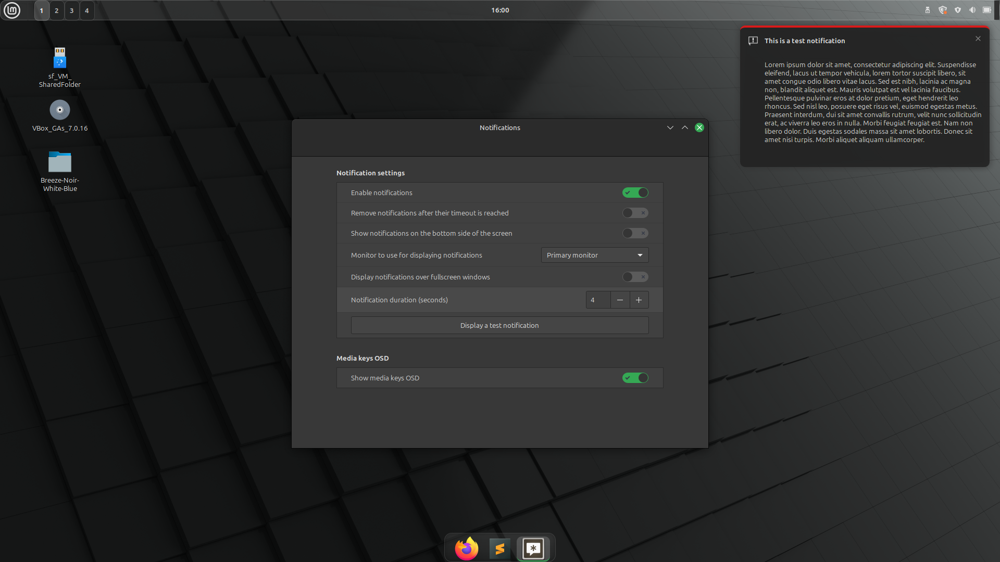
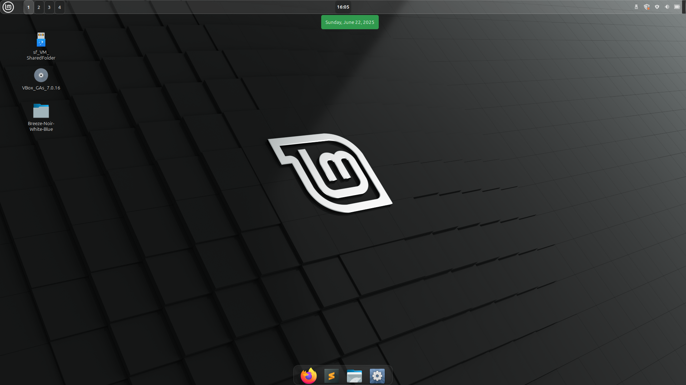

# 🌿 NeoMint - A Sleek Glass-Inspired Cinnamon Theme

NeoMint is a modern, customized Linux Mint Cinnamon theme based on **Mint-Y-Green**. It brings a clean, frosted-glass aesthetic to your desktop with thoughtfully designed panel styling and future-ready visuals.

> 🎨 A fresh blend of minty color tones and translucent UI, perfect for minimalists and glass theme lovers.

---

## ✨ Features

- 🧊 **Top panel with frosted glass effect**
- 🌫 **Transparent bottom panel** for a subtle dock-like feel
- 🛠️ Future enhancements planned (workspace styling, applet refinements, and more)
- 🎨 Clean and consistent colors with soft transitions

---

## 📷 Preview

Home

Notification

Hover over applet


*Other features Coming soon...*  

---

## 📦 Installation

1. Download or clone this repository:
   ```bash
   git clone https://github.com/Nitesh4546/NeoMint.git
    ```
2. Copy it to your Cinnamon themes directory:
    ```bash
    mkdir -p ~/.themes
    cp -r NeoMint ~/.themes/
    ```
3. Open Themes in Cinnamon Settings and apply NeoMint as your desktop theme.

---

## License & Credits
- 🔓 This theme is based on Mint-Y-Green, an official Linux Mint theme.

- Licensed under the GNU GPL v2 or later.

- Credit to the Linux Mint team for the original base theme.

>⚠️ This is a community-created theme and is not affiliated with or endorsed by the Linux Mint team.

---
## 💡 Contribute
Want to help improve NeoMint?
Feel free to fork, submit issues, or open pull requests for tweaks and features.

## 💚 Author

Crafted with care by Nitesh4546

---

